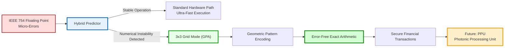
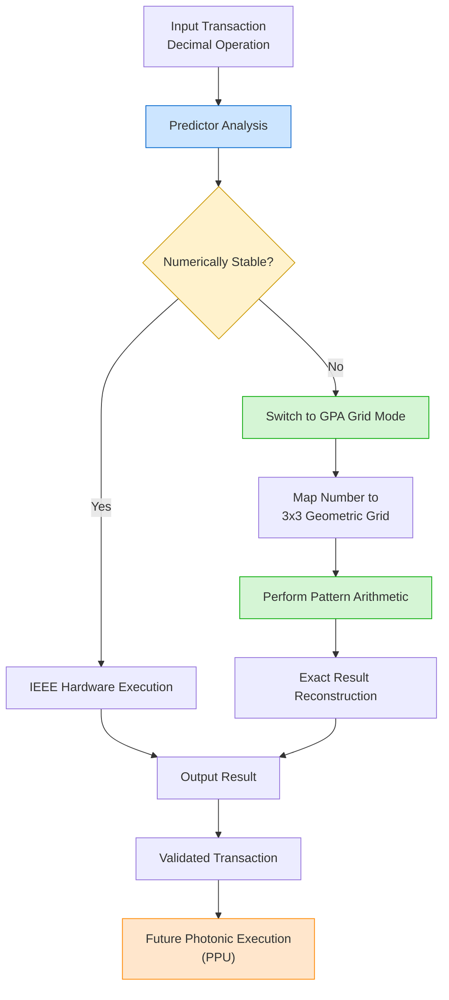

# pattern-based-predictor

**Geometric Pattern Arithmetics (GPA)**  
*Fehlerfreie Hochgeschwindigkeits-Logik*


---

## Overview

**Geometric Pattern Arithmetics (GPA)** ist ein neuartiger Rechenansatz zur Eliminierung von Rundungsfehlern in hochkritischen numerischen Systemen.

Während klassische IEEE-754-Fließkomma-Arithmetik unvermeidbare Präzisionsverluste erzeugt, nutzt GPA eine **geometrische Rasterkodierung**, um numerische Operationen exakt und deterministisch auszuführen.

Ziel ist die Entwicklung einer hybriden Architektur für:

- Hochfrequenzhandel
- Banking-Systeme
- Echtzeit-Sicherheitskritische Anwendungen
- Photonische Rechenarchitekturen

---

## The Problem

Heutige Computersysteme auf Basis von **IEEE 754 Floating Point Arithmetic** erzeugen unvermeidbare Rundungsfehler.

Diese sogenannten **Micro-Errors** führen insbesondere in:

- Hochfrequenzhandel
- Banking
- Finanzsimulation
- Risikoanalyse

zu:

- Phantom-Profiten
- Numerischer Drift
- Fehlerhaften Entscheidungen
- Realen finanziellen Verlusten

Exakte Alternativen wie **BigDecimal** sind für Echtzeitverarbeitung zu langsam.

---

## The Solution: 3x3 Geometric Grid Encoding

Anstatt Zahlen als ungenaue Dezimalwerte zu speichern, repräsentiert GPA Zahlen als **geometrische Zustände innerhalb eines 3x3-Gitters**.

Dadurch gilt:

- Feste diskrete Zustände
- Keine Zwischenwerte
- Keine Rundungsfehler
- Deterministische Rechenoperationen

---

## Architecture Overview



---

## Execution Pipeline



---

## Hybrid Predictor

Eine KI-gestützte Logikschicht analysiert jede numerische Operation in Echtzeit.

### Standardmodus
Normale Hardwareberechnung bei stabilen Operationen.

### Schutzmodus
Automatische Umschaltung in den GPA-Gittermodus bei:

- Kritischer Subtraktion
- Präzisionsverlust
- Numerischer Instabilität
- Risiko mathematischer Drift

---

## Future Vision: Photonic Processing Unit (PPU)

Langfristig wird GPA in einen photonischen Spezialchip integriert.

Vorteile:

- Lichtgeschwindigkeits-Arithmetik
- Parallelisierte Musterüberlagerung
- Absolute Präzision
- Bankgrade Reliability

Die Addition erfolgt durch **optische Überlagerung geometrischer Lichtmuster**.

---

## Current Status

✅ Software-Prototyp (Python-Simulation) funktionsfähig

Der aktuelle Prototyp demonstriert:

- Erkennung numerischer Instabilität
- Selektives Umschalten
- Fehlerfreie Transaktionsabsicherung
- Simulation hybrider Hardwarelogik

---

## Repository Structure

```text
pattern-based-predictor/
│
├── predictor/
├── simulation/
├── tests/
├── docs/
└── README.md
```

---

## License

Licensed under the **Apache License 2.0**
